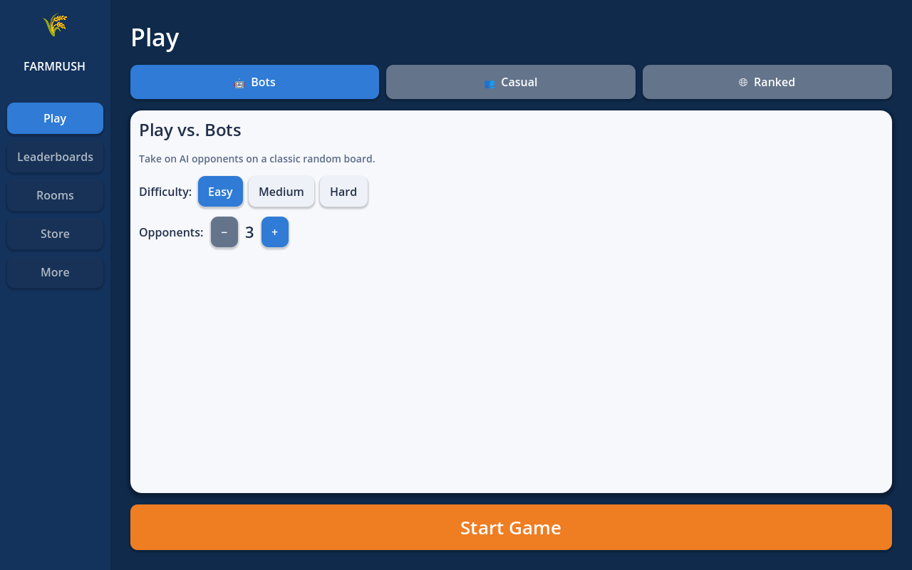

# Hexbound 🌾

A cozy, **Catan-style** hex board game built in **Godot 4** — designed to ship
to **Steam** (Windows / macOS / Linux). Same core logic and gameplay as
*The Settlers of Catan* / *colonist.io*, rendered as a vibrant, chunky **3D
digital tabletop** (Pummel Party / Mario Party vibe).




## Modern UI (colonist.io-style)

The interface uses one shared style helper (`UITheme`) for a clean, modern
browser-game feel — rounded white `StyleBoxFlat` panels with soft drop shadows
and chunky colored buttons:

- **Start screen** (`MainMenu`): left nav sidebar, **Bots / Casual / Ranked**
  tabs, a styled mode card (difficulty + opponent count), and a big Start button.
- **In-game HUD** (`GameScreen`, a transparent `CanvasLayer` overlay):
  - **Top banner** — current player + prompt.
  - **Right hub** — a scrolling **Game Log** over a **Players** list (color,
    name, VP, resource/dev-card counts, knights, Longest Road / Largest Army).
  - **Bottom action hub** — the active hand as resource chips plus chunky
    **Roll / Road / Settlement / City / Buy Card / Play Card / Trade / End Turn**
    buttons that enable only when the action is legal/affordable.

### Editor node tree for the HUD

The HUD is built in code, but the equivalent scene tree is:

```
GameScreen (Control, anchors Full Rect, mouse_filter = Ignore)
├─ TopBanner (PanelContainer, top-center)        # StyleBoxFlat: white, radius 14
│   └─ HBox → [ColorRect swatch] [prompt Label]
├─ RightHub (PanelContainer, right dock 336px)
│   └─ VBox
│        ├─ Label "Game Log"
│        ├─ PanelContainer (soft)  → RichTextLabel (scrolls, expand)
│        ├─ Label "Players"
│        └─ ScrollContainer (expand) → VBox (one PanelContainer row per player)
├─ ActionHub (PanelContainer, bottom dock, right offset 348px)
│   └─ VBox
│        ├─ HBox (Hand)    → [Label "Hand:"] [resource chips ×5]
│        └─ HBox (Actions) → [Dice Label] [chunky Buttons ×8]
└─ Toast (Label) + modal overlays (discard / steal / trade / dev / win)
```

## 3D tabletop view

The board is a 3D scene (`Game3DWorld`) and is the **default** in-game view:

- **Beveled, two-layer hex tiles** (dirt/stone base + colored top) generated
  from the engine's axial coordinates, with slightly randomized top vertices so
  the terrain isn't perfectly flat.
- **Procedural terrain shaders** (`shaders/terrain.gdshader`) — noise-blended
  grass/forest/field, rocky ore/brick, and wavy desert dunes (no textures).
- **Animated water shader** (`shaders/water.gdshader`) — TIME-driven wave
  displacement and an animated foam ring at the shoreline.
- **Micro-props**: clean low-poly primitives per resource — pine cone/trunk
  trees on Wood, stacked brick prisms on Brick, fluffy capsule sheep on
  Sheep, thin golden stalks on Wheat, blocky dark rocks on Ore — clustered
  near each tile's center, well clear of the settlement circles on the
  vertices.
- **Juicy feedback**: hexes lift on hover (Tween), settlements/roads/cities
  *pop in* with an elastic overshoot, and a translucent glowing **hologram**
  previews your placement under the cursor.
- **Floating number tokens** that bob and slowly spin above each tile.
- **3D physics dice** (`scripts/dice/`) that can be physically thrown and read
  by their resting top face.

Camera (`CameraRig3D`): isometric ~55° tabletop view, **WASD / arrows** or
**edge-scroll** to pan (clamped to the board), **scroll wheel** to zoom, and
**middle-mouse drag** to orbit.

> The 2D board is still available — launch with `HEXBOUND_2D=1` to use it.

### Renderer note (for the full toy look)

The project ships on **Forward+** (Vulkan) for the premium "toy-box diorama"
look: deep **SSAO** crevices between tiles, **bloom**, ACES color grading with a
saturation/contrast pop, soft low-angle directional shadows, and a low-FOV
telephoto camera. These all live in `Game3DWorld._setup_environment` /
`_setup_light` and `CameraRig3D`.

SSAO/glow are guarded behind a Vulkan `RenderingDevice`, and the custom shaders
also run on the **Compatibility (GLES3)** renderer, so if you need to target
web / very old GPUs you can switch `Project Settings → Rendering → Renderer →
Rendering Method` back to **gl_compatibility** (or launch with
`--rendering-method gl_compatibility`); you'll keep the camera, shadows,
materials and colors but lose SSAO/glow.

## Game modes

- **Single Player** — play against 1–5 heuristic AI opponents.
- **Local Hotseat** — 2–6 humans, pass-and-play on one screen.
- **Online Multiplayer** — host/join over the network (Godot high-level
  multiplayer / ENet). The host is authoritative and syncs game state to all
  clients.

## How to play

Classic Catan rules:

1. **Setup** — in snake order, each player places 2 settlements + 2 roads.
   Your second settlement grants starting resources.
2. **Roll** the dice each turn. Tiles matching the roll produce resources to
   adjacent settlements (×1) and cities (×2). Rolling a **7** triggers the
   robber: anyone holding 8+ cards discards half, then the roller moves the
   robber and steals a card.
3. **Build & trade** — spend resources to build:
   - Road: 🌲 + 🧱
   - Settlement: 🌲 + 🧱 + 🐑 + 🌾 (1 VP)
   - City (upgrade): 3 ⛰️ + 2 🌾 (2 VP)
   - Development card: ⛰️ + 🐑 + 🌾
   Trade with the bank at 4:1, or 3:1 / 2:1 if you sit on a port.
4. **Win** at **10 victory points** (settlements, cities, hidden VP cards,
   +2 for Longest Road ≥5, +2 for Largest Army ≥3 knights).

Development cards: Knight, Victory Point, Road Building, Year of Plenty,
Monopoly.

## Running it

1. Install [Godot 4.2+](https://godotengine.org/download) (standard, GDScript).
2. Open this `godot/` folder as a project and press **▶ Play**.

### Export for Steam

`Project → Export…` and add Windows / macOS / Linux presets. For Steam
achievements / friends, add the [GodotSteam](https://godotsteam.com/) addon and
wire it into a thin layer over `NetworkManager`. The game already uses Godot's
built-in multiplayer for online play, so no extra backend is required for
peer-hosted matches.

## Project layout

```
godot/
├── project.godot              # autoloads: Net (networking), Game (match manager)
├── scenes/
│   ├── Main.tscn              # root; swaps Menu / Lobby / Game screens
│   └── Game3D.tscn            # 3D tabletop world (Game3DWorld)
├── shaders/
│   ├── terrain.gdshader       # stylized grass/rock/sand terrain
│   └── water.gdshader         # animated water + shore foam
├── scripts/
│   ├── core/
│   │   ├── Consts.gd          # rules constants, resources, costs, colors
│   │   ├── HexBoard.gd        # board geometry: hexes, vertices, edges, ports
│   │   ├── Player.gd          # per-player state (serializable)
│   │   ├── GameState.gd       # authoritative headless rules engine
│   │   └── GameManager.gd     # autoload "Game": modes, action routing, AI/sync
│   ├── ai/AIBot.gd            # heuristic opponent
│   ├── net/NetworkManager.gd  # autoload "Net": host/join + lobby
│   ├── dice/                  # Dice3D + DiceManager (3D physics dice)
│   └── ui/
│       ├── UITheme.gd         # shared StyleBoxFlat styling (panels/buttons/chips)
│       ├── Main.gd            # screen router (3D by default)
│       ├── MainMenu.gd, Lobby.gd
│       ├── GameScreen.gd      # HUD, dialogs, interaction (2D + 3D)
│       ├── BoardView.gd       # 2D board rendering + click picking
│       ├── BoardView3D.gd     # 3D board: prisms, hover/pop animation, tokens
│       ├── CameraRig3D.gd     # isometric pan/zoom/orbit camera
│       └── Game3DWorld.gd     # assembles env + light + camera + board + HUD
└── tests/
    ├── sim.gd                 # headless AI-vs-AI full-game self-test
    └── screenshot.gd          # render a frame to PNG
```

The rules engine (`GameState`) is fully **headless and deterministic-friendly**,
so the same code drives local play, the AI, and the networked host.

## Testing

```bash
# Full AI-vs-AI games + JSON state round-trip (no display needed)
godot --headless --script res://tests/sim.gd
```

Dev hooks (env vars): `HEXBOUND_AUTOSTART=1` boots straight into a vs-AI game;
`HEXBOUND_SCREENSHOT=1` saves `tests/board_preview.png` and quits.
